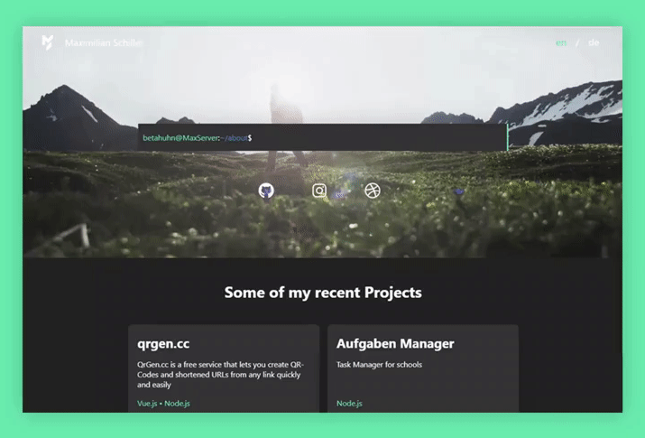

<div align="center">



# Vue.js Portfolio website

[](https://github.com/BetaHuhn/portfolio/actions?query=workflow%3A%22Build+CI%22) [](https://github.com/BetaHuhn/portfolio/actions?query=workflow%3A%22Release+CI%22)
   

My personal portfolio website

[🔮 Live version](https://maximilianschiller.de)
<br/>

</div>

## Installation

Download the repo:

```
git clone https://github.com/BetaHuhn/portfolio
```

Change directory:

```
cd portfolio
```

Install Vue.js dependencies:

```
npm install
```

Build frontend:

```
npm run build
```

Development

```
npm run serve
```

## Authors
* **Maximilian Schiller** ([@BetaHuhn](https://github.com/BetaHuhn))

## License

This project is licensed under the MIT License - see the [LICENSE.md](LICENSE.md) file for details
